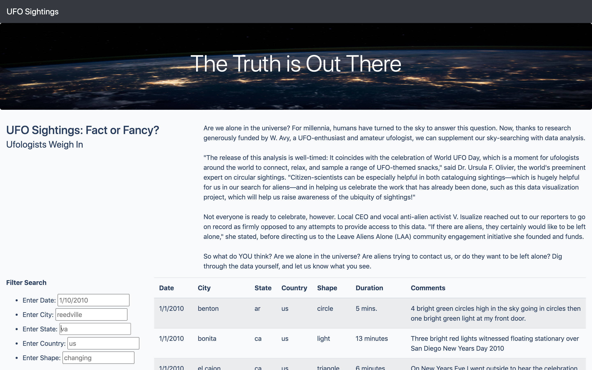
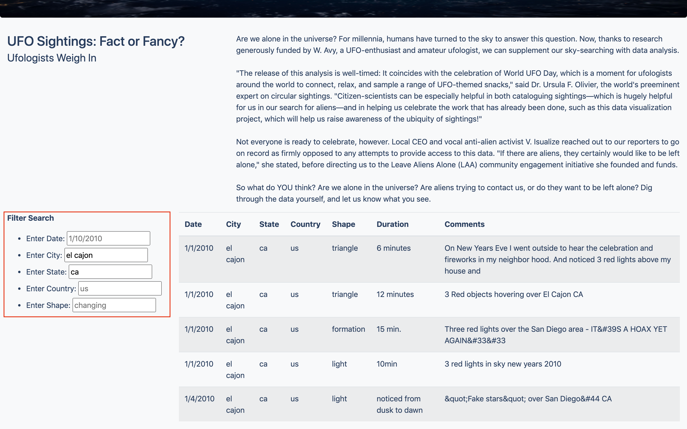

# UFO Sightings Analysis

# Overview
Our client, Dana, wanted a way to view UFO data in an interactive manner that would provide an in-depth analysis. The goal of this task was to create site where Dana's clients can input multiple criteria and the site will update with the filtered data.

# Results
When Dana visits the webpage, the page will look like the image below.

In order to perform a search, the user will have to enter in the information they wish to search for in the left sidebar. Once the information is entered, the webpage will return the relevant UFO information. The image below highlights where the user will need to input their desire location or shape, and shows an example of the UFO results returned for El Cajon, CA.

# Summary

Although this webpage provides Dana with what she has requested, there is a drawback to this webpage. One drawback being that the webpage search filters are case sensitive. This means that the user could search for a location that exists in the dataset, but because filter is case sensitive the webpage would result zero returns. For example, the user would have to input "el cajon" rather than "El Cajon."

Two recommendations for further development of this web page include:
* Accounting for seach case sensitivity. Enabling this feature would allow for users to enter the informationr regardless of text format.
* Accounting for partial dates. A user would have to know the full data, i.e. '1/10/2010', in order to search for the UFO information - for further development, the webpage can only ask for the month and year and search the UFO dataset. With this development, the user can search for '01' for month and '2010' for year which will yield a higher number of results.
